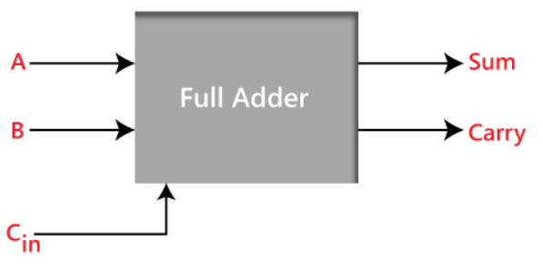
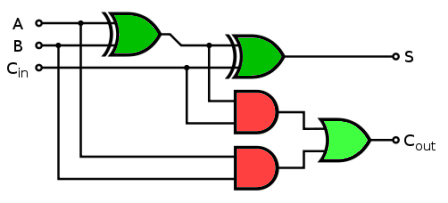
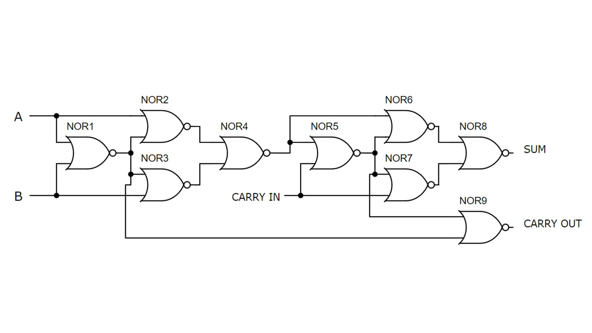
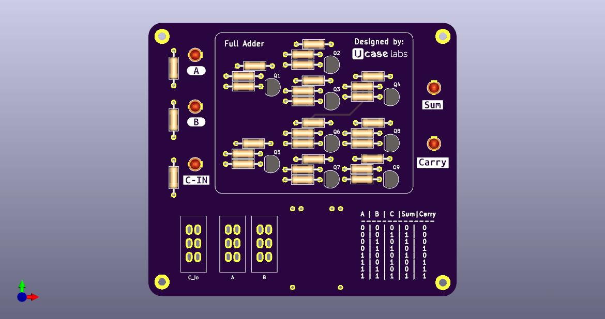

# Full Adder

## Overview

A **1-bit Full Adder** is a basic circuit used to add three input bits: two data bits (**A** and **B**) and a carry-in bit (**Cin**).

It produces two outputs:

- **Sum**: The result of the addition.
- **Carry (Cout)**: The carry passed to the next bit in case of multi-bit additions.

This circuit plays an important role in digital electronics and serves as the foundation for larger systems like multi-bit adders used in microprocessors.

## Design and Implementation

### Initial Plan

At first, I followed the typical textbook design, which uses:

- **2 XOR gates**
- **2 AND gates**
- **1 OR gate**

    

This approach worked, but it required more transistors than I expected. Every gate used multiple transistors, so the total count grew quickly.

### Optimized Approach

To make it simpler, I tried using **only NOR gates**. This reduced the number of components, and I was able to build the adder using just **9 transistors**. It was a good way to explore how small changes can make a big difference in circuit design.

## Truth Table

    Sum: A ⊕ B ⊕ Cin
    Carry (Cout): (A · B) + (Cin · (A ⊕ B))

| **A** | **B** | **Cin** | **Sum** | **Cout** |
| :---: | :---: | :-----: | :-----: | :------: |
|   0   |   0   |    0    |    0    |    0     |
|   0   |   0   |    1    |    1    |    0     |
|   0   |   1   |    0    |    1    |    0     |
|   0   |   1   |    1    |    0    |    1     |
|   1   |   0   |    0    |    1    |    0     |
|   1   |   0   |    1    |    0    |    1     |
|   1   |   1   |    0    |    0    |    1     |
|   1   |   1   |    1    |    1    |    1     |

---

## My Design Journey

I first got the idea for this project in my **Digital Logics** class, where we learned about logic gates and how they are built. I thought it would be fun and helpful to build a real circuit and see how the gates work together. I had already made a schematic of the prototype earlier, but the final version came together during **Workshop 101** by **LAB448** at **Pashchimanchal Campus**.

## PCB

After the success of the prototype, I decided to make a PCB for the adder. This pcb is designed to be used as a module to make the student understand the concept of full adder.

---

## References

- [9 transistor full adder [YouTube]](https://www.youtube.com/watch?v=DtL7BKjrqFo)
- [Fundamental of TTL gates](http://hyperphysics.phy-astr.gsu.edu/hbase/Electronic/trangate.html)

This repository not only tracks the **1-bit Full Adder** but also keeps a record of my progress and future updates. It will serve as a reference for new experiments and improvements.
